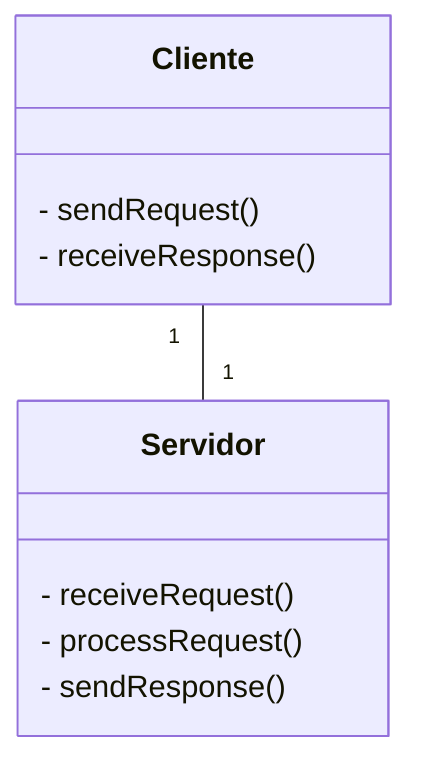
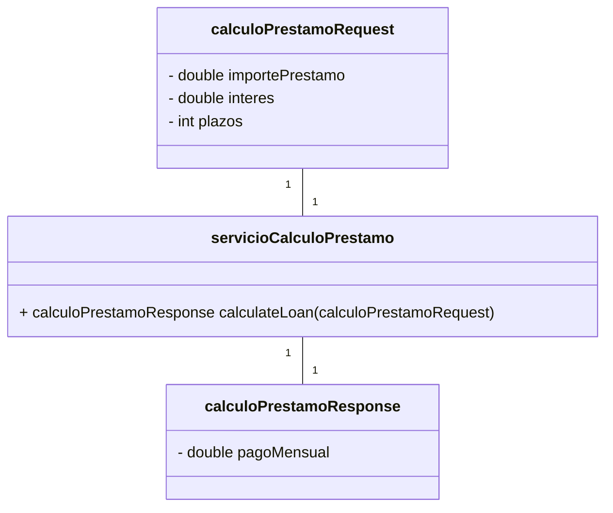
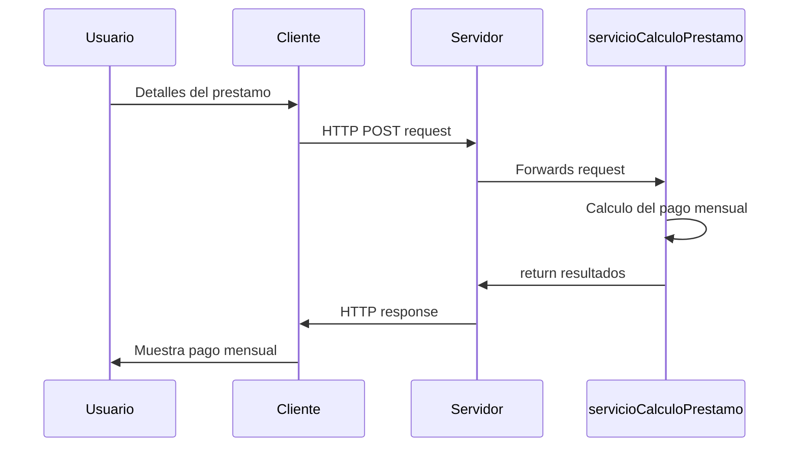

# Calculadora de prestamos para autos
# Análisis
### Requerimientos

**Funcionales**
    - Debe contener una aplicación sencilla interfaz web con campos de entrada para el calculo del prestamo.
    - Debe de visualizrse el pago mensual calculado.
    - La aplicación debe calcular el pago mensual en base a las fórmulas de préstamos estándar de Panamá.
    - Los campos de entrada deben validar la entrada del usuario para asegurar que es numérica y dentro de límites razonables.

**No funcionales**
    - La aplicación debe responder rápidamente a las entradas del usuario.
    - El cálculo debe realizarse de forma eficiente.
    - Interfaz del usuario debe ser intuitiva y fácil de usar
    - La validación de las entradas de datos lo que pude ayudar a mitigar el riesgo de errores y seguridad.
    - Uso de HTML y CSS adecuados para garantizar la accesibilidad de la Web.

# Diseño del sistema

**Cliente**
- Crearemos en **HTML:** la estructura basica de la pagina web, la que incluira las entradas del usuario para el calculo.
- **JavaScript:**
    - Para manejar la entrada y validación del usuario.
    - Enviar un **POST** request al servidor con los detalles del préstamo.
    - Recibir del servidor el pago mensual calculado y mostrarlo en la página.


*cliente-servidor*

**Server creado con Java:**
- **API:**
    - Creamos un API endpoint `http://localhost:3000/calcular` para gestionar la solicitud POST del cliente.
    - Extraemos los detalles de entrada validamos los datos y calculamos el pago.

*Diagrama de clases del cliente*

    - Calcular el pago mensual.
    - Devolver el pago calculado como una respuesta JSON.
    - Implementar la lógica de cálculo del préstamo utilizando la fórmula estándar.

*Diagrama de secuencia comunicacion cliente servidor*

# Implementación
##### Servidor
**Iniciar servidor**
```bash
javac app.java
```

##### Cliente
Abrir **index.html** con live server (si utilizas VS Code) o cualquier navegador Web.

# Problemas encontrados y recomendaciones

##### Problemas encontrados:
1. Falta de experiencia utilizando una de las herramientas nesesarias para el sistema (**Java**).

##### Recomendaciones:
1. Si el numero de usuarios incrementa el sistema no podra ser capaz de prosesar toda lacarga, lo que nos forzaria a escalar la aplicacion de manera horizontal.
2. La interfaz de usuario se puede mejorar agregando mensajes de error, comentarios de ayuda y indicadores de carga.

